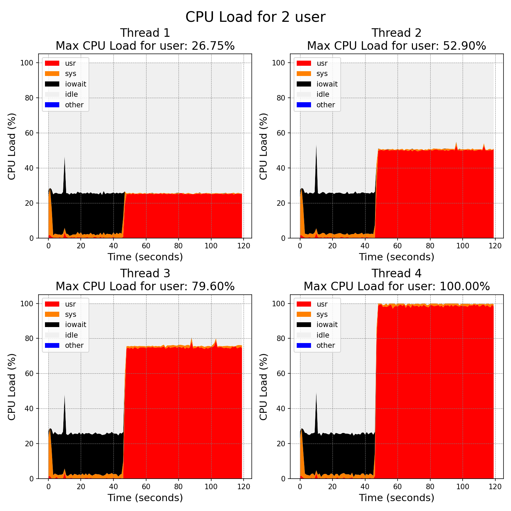
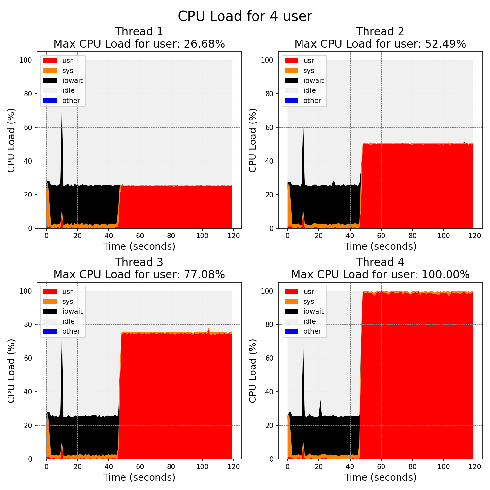

CPU
---------------------------------

The graphs present an analysis of the CPU core utilization on a Raspberry Pi 5 during the initial two minutes of inference with the 4-bit quantized Llama-2 model, showcasing the impact of varying numbers of simultaneous users and thread counts on performance.

Upon analysis, it becomes evident how CPU consumption fluctuates in tandem with the thread count. A solitary thread leads to approximately 25% CPU utilization, reflecting the engagement of only one core. Utilizing two threads escalates the CPU usage to roughly 50%, and this pattern persists, underscoring the model's capacity for parallel execution across multiple cores, thereby enhancing inference efficiency.

The correlation between thread count and CPU usage offers valuable insights into the parallelism and efficiency of the model's inference mechanism. Specifically, if the addition of threads does not result in a commensurate increase in CPU usage, it may signal a bottleneck, potentially attributable to memory access constraints or other system resource limitations.

The quantized 2-bit model gave similar results. This similarity in performance indicates that the Raspberry Pi 5 is being fully utilized, demonstrating that both models are operating at the device's maximum capacity.
