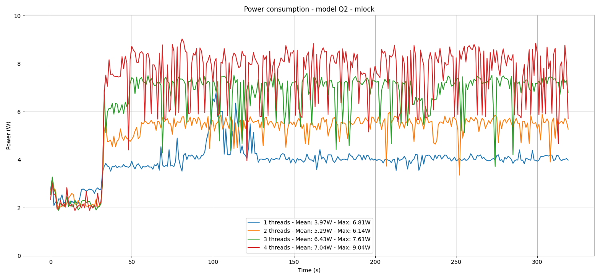
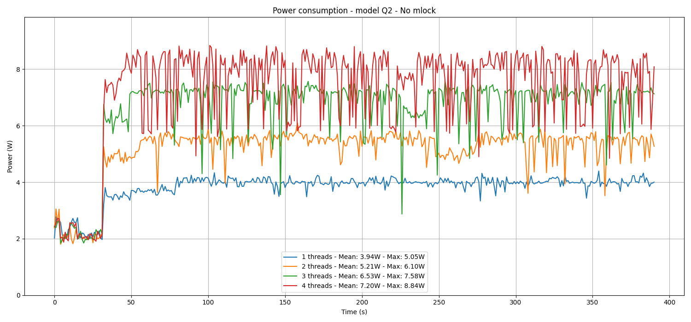
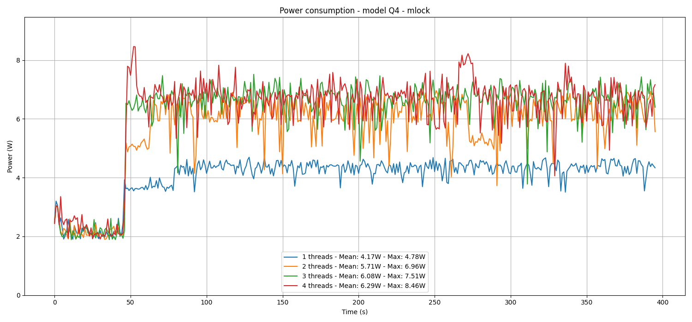
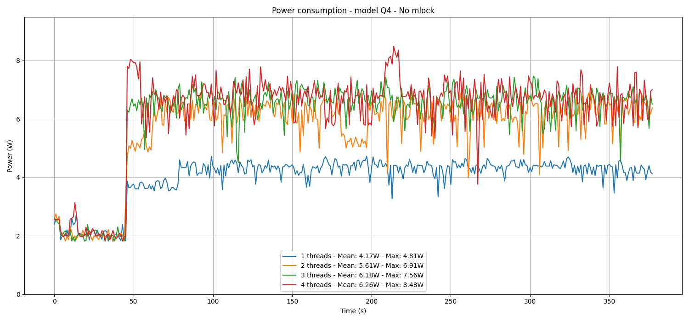

Energy and Power
---
In the charts that follow, we examine the power consumption during the inference process across various configurations. Notably, the --mlock and --no-mmap options appear to have a minimal effect on energy use.

Interestingly, it is observed that the 4-bit model uses less power than the 2-bit model. This reduction in energy consumption may be attributed to data transfers that potentially slow down the CPUs, leading to lower energy costs.

