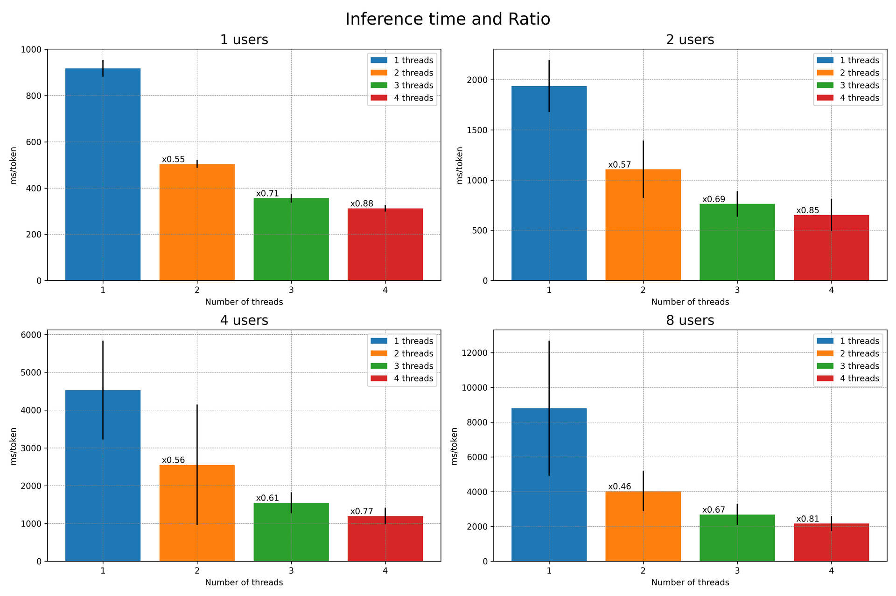
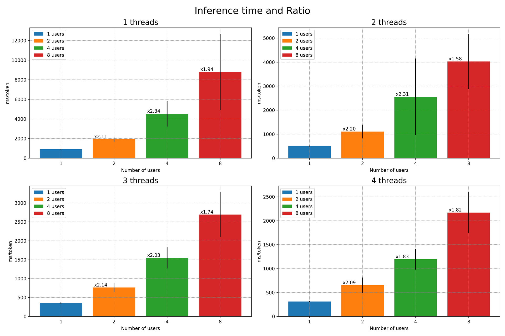
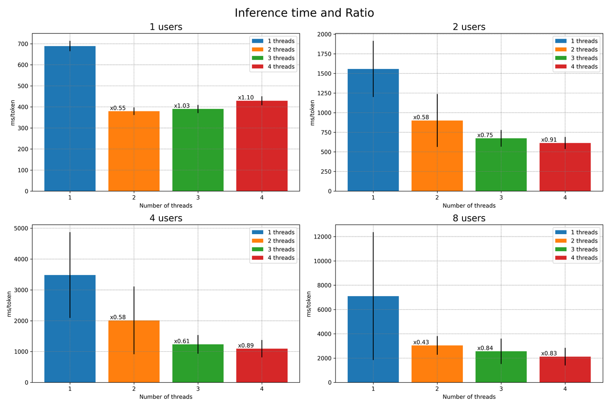
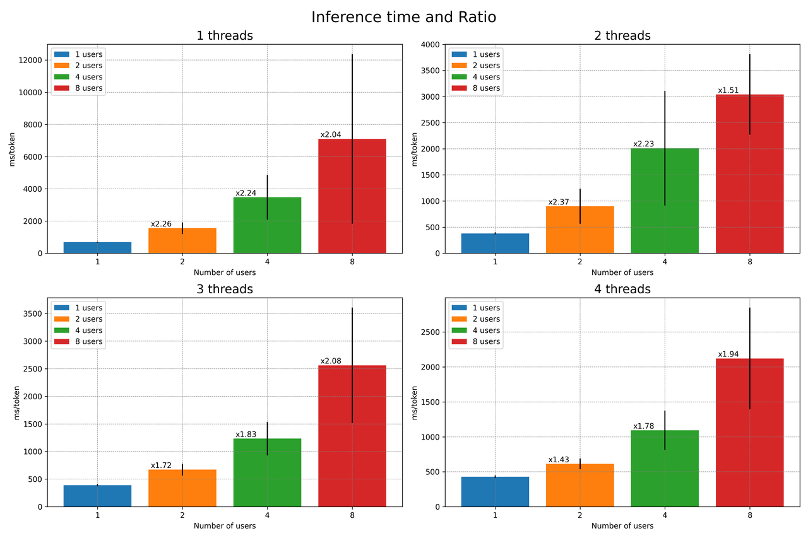
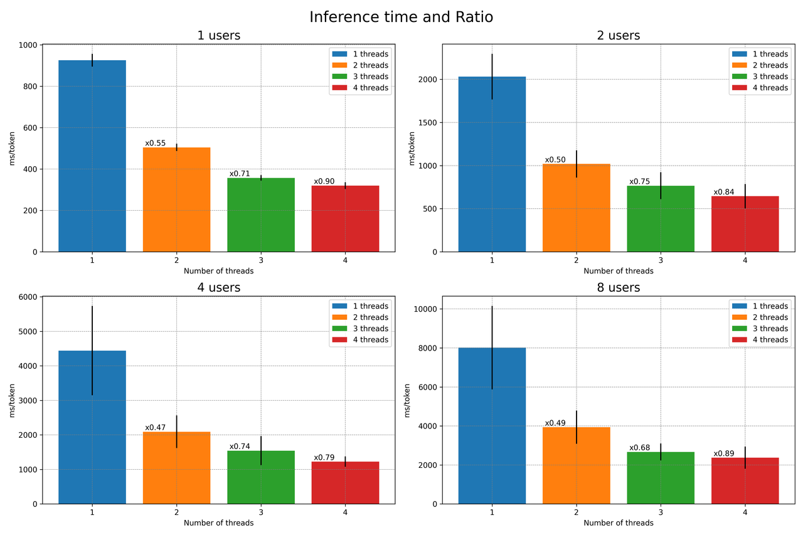
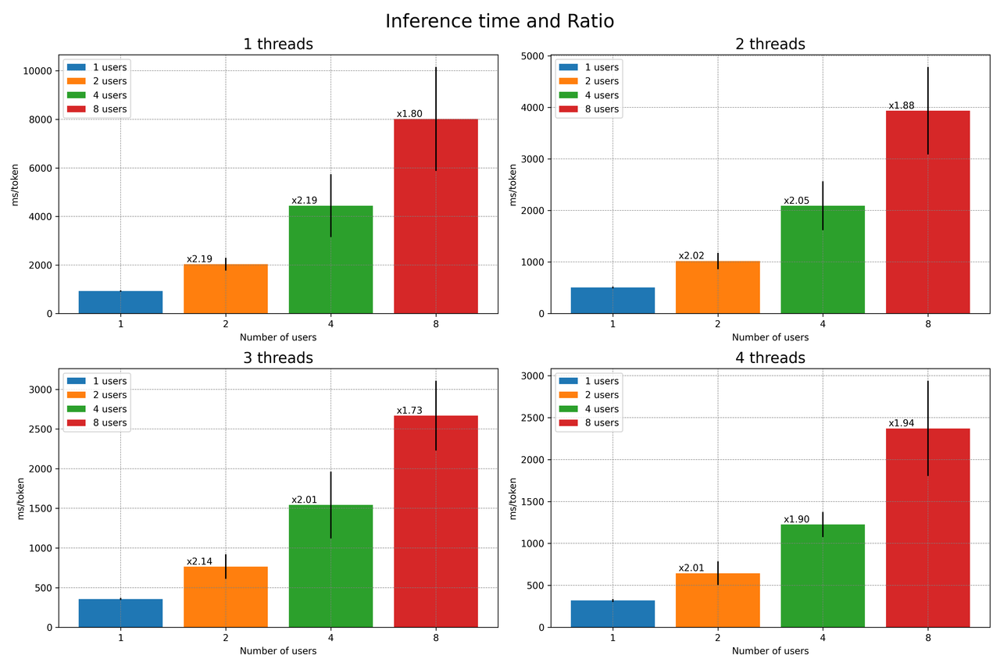
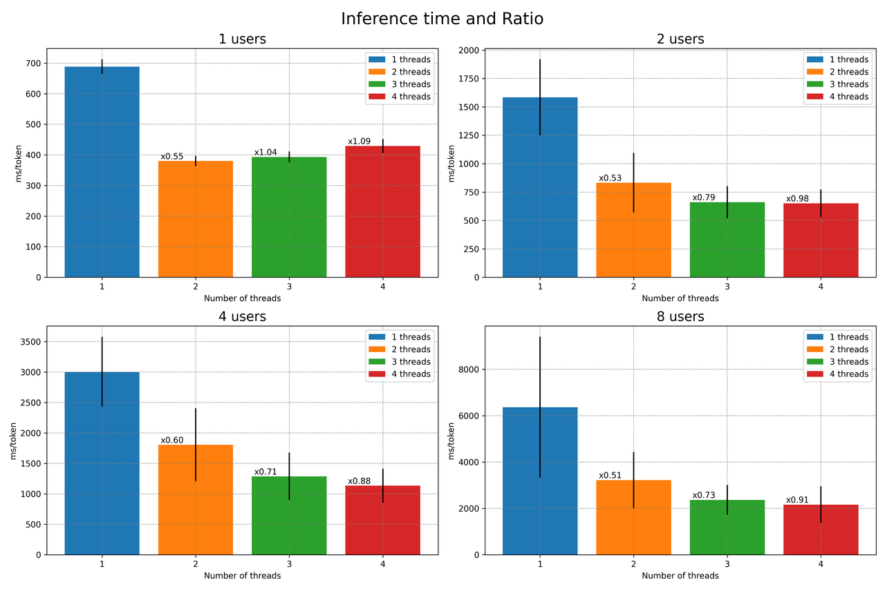
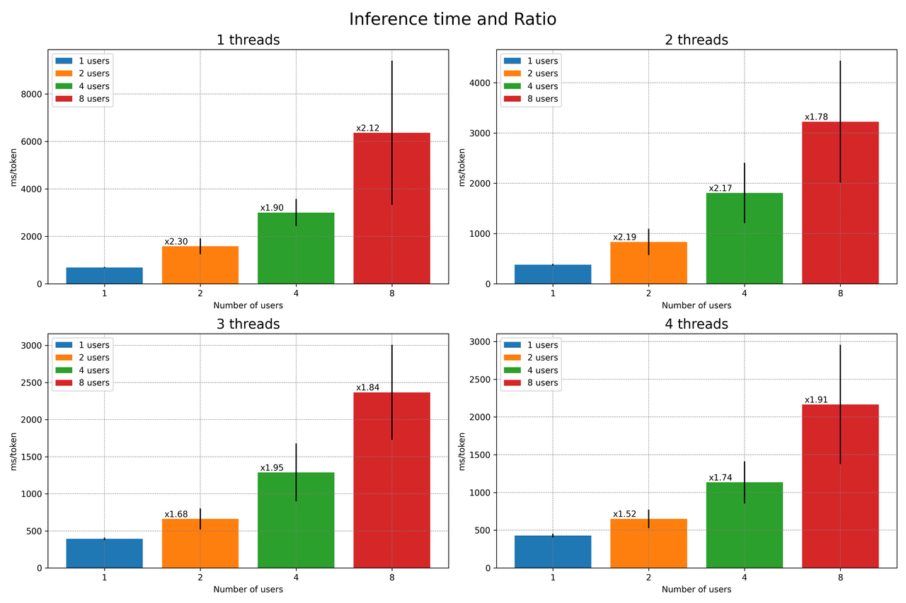

Inference time
---

In the charts shown, we look at how long it takes to process data using two different quantization methods, with the number of users at the same time going from **1 to 8**. Also, for every setup, we tried using **different amounts of threads** to see how it changes the processing times. In the end, we also did tests with the **--mlock** and **--no-mlock** settings to check their impact on processing times.

For each setup, we observe two comparable graphs. The first graph displays the inference times based on the number of threads used. The second graph illustrates the inference times relative to the number of concurrent users.

Additionally, there's a number on each bar that indicates the ratio between the inference time with the previous number of threads and the inference time with the current number of threads, or in the case of the second graph, the ratio between the inference time with the previous number of users and the inference time with the current number of users.

With option --mlock and --no-mmap actived:
------------------------------------------

### Model quantized at 2 bits

As expected, we can observe that the inference time decreases as the number of utilized threads increases, and conversely, it rises with the number of concurrent users. The ratio between executions with 1 thread and 2 threads is close to 0.5, indicating efficient parallelization. However, beyond this point, increasing the number of threads does not yield as favorable results. This could be attributed to a progressively significant overhead as the number of threads grows.

Here, we observe the same data as before but focusing on the impact on the number of concurrent users. We notice that the ratio is close to 2 in most cases, which aligns with the doubling of the number of users. However, it's also evident that the standard deviation significantly increases, making the inference time increasingly uncertain as the number of users grows.

### Model quantized at 4 bits

Here, we look at the version with the model quantized to 4 bits. An interesting phenomenon is observed in the case of a single user. We find that there is no improvement in inference time with the use of 2 threads, and there's even an increase in time. To verify these results, we repeated the tests several times and obtained the same outcomes. This can be explained by an overhead created by the movement of data between threads. Indeed, the model quantized to 4 bits is larger than the one at 2 bits, and therefore, the movement of data between threads is more significant. Further testing would be necessary to confirm this hypothesis.

Just like with the 2-bit model, we see an increase in both inference time and variance. We can conclude by stating that the inference time appears too large to allow for a fluid multi-user chatbot system with this setup.

Without option --mlock and --no-mmap actived:
---------------------------------------------

In the subsequent graphs, we observe the same configurations but without the --mlock and --no-mmap options. Overall, we witness similar phenomena as before. However, it is noted that the inference time is longer for each equivalent configuration when the --mlock and --no-mmap options are activated. Therefore, we can conclude that these options have a positive impact on inference time.

### Model quantized at 2 bits

