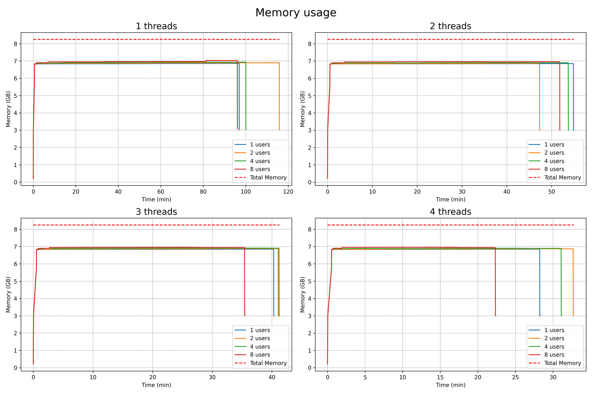
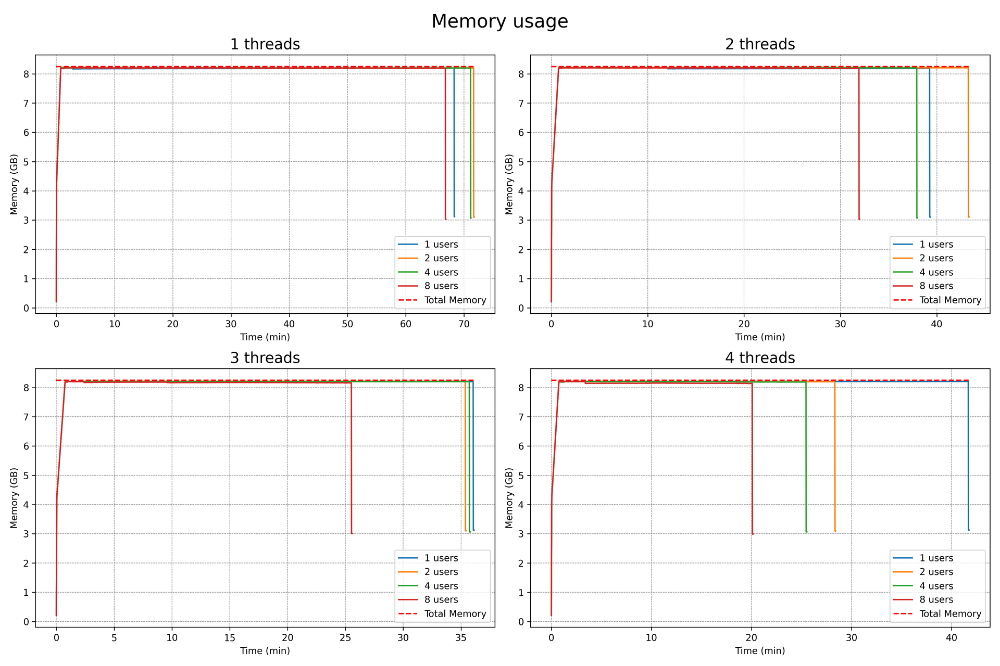
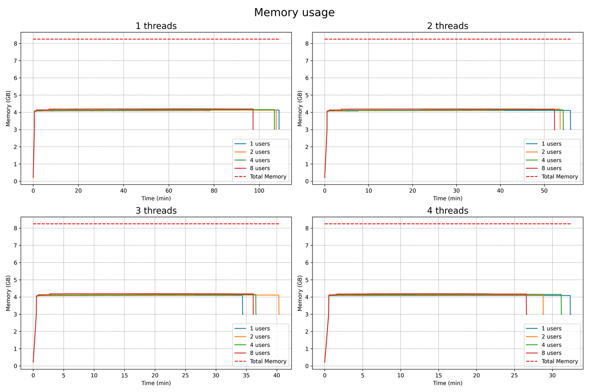
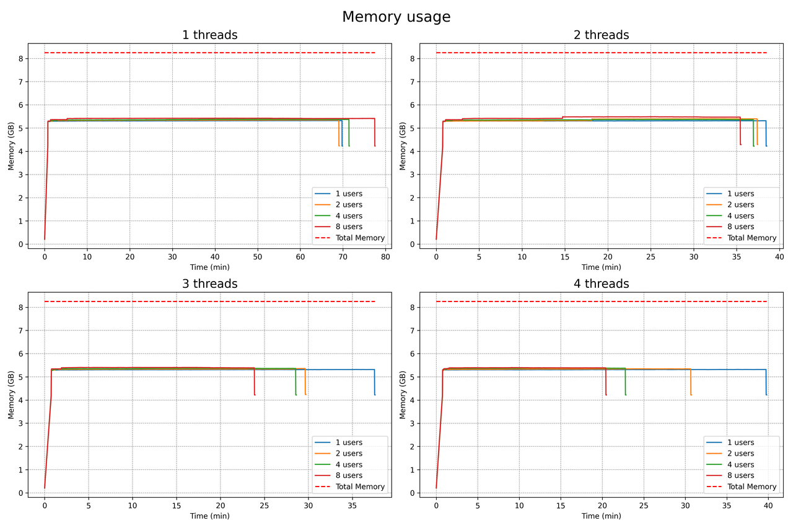

Memory
---
In the following graphs, we see memory usage for the different configurations. It's clear that neither the number of threads nor the number of users impacts memory utilization. However, the impact of the --mlock and --no-mlock options on memory is evident, with usage close to 100% for the 4-bit case. This suggests that the 4-bit model is the maximum model size that can fit in memory.

With option --mlock and --no-mmap actived:
------------------------------------------

### Model quantized at 2 bits:

### Model quantized at 4 bits:

Without option --mlock and --no-mmap actived:
---------------------------------------------

### Model quantized at 2 bits:

### Model quantized at 4 bits:

