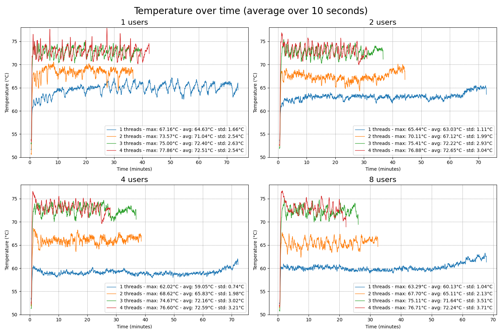
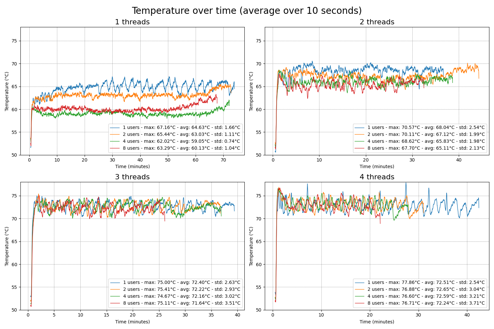
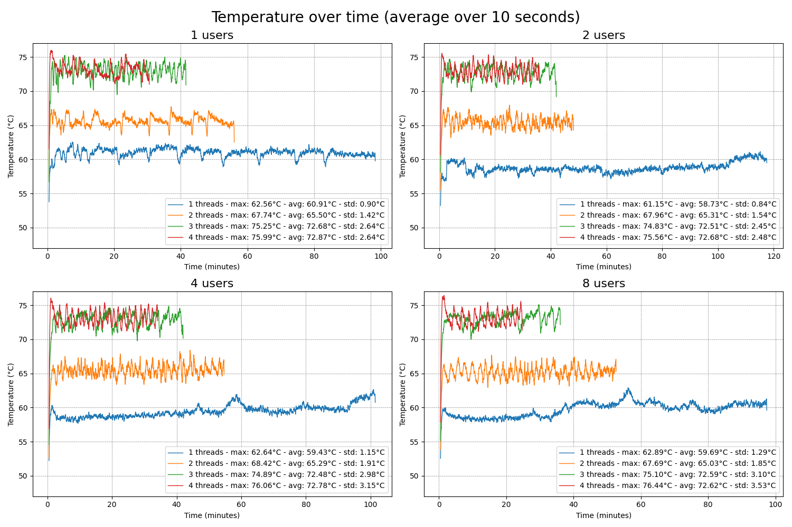
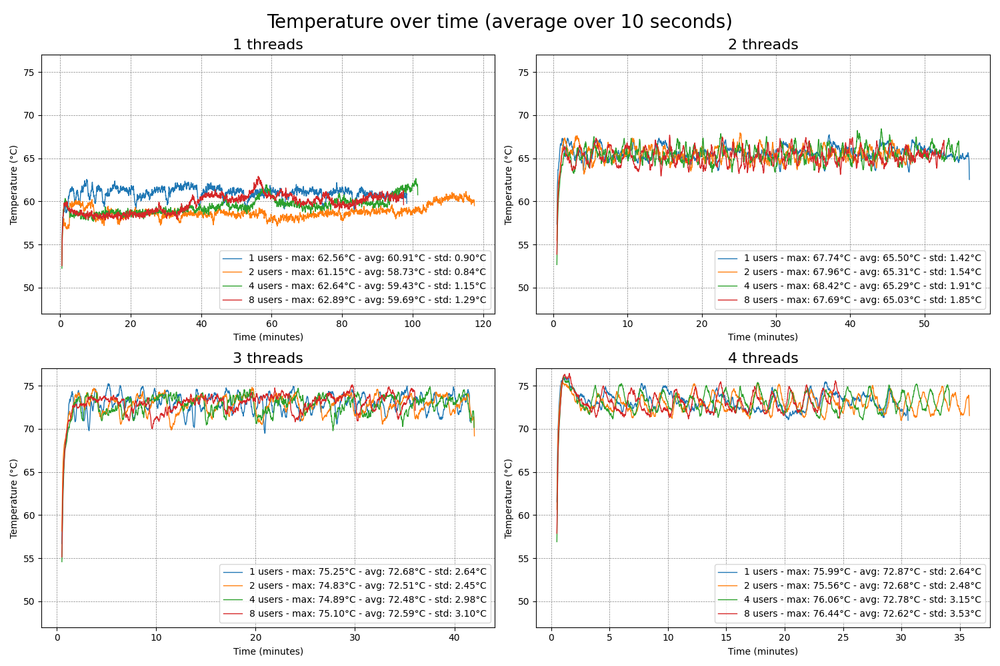

The following figures illustrate the evolution of temperature during the inference process, one in relation to the number of threads and the other in relation to the number of users.

LLama-2 Model quantized at 4 bits
---------------------------------

### Temperature per number of users comparing different thread configurations

Overall, we observe **an increase in temperature corresponding to the number of threads**, which aligns with expectations as a greater number of threads augments CPU workload.

Interestingly, configurations with **one and two users utilizing** **1 or 2 threads exhibit higher temperatures than those with 4 and 8 users** for the same thread counts. This suggests that increased context switching with more users potentially allows the CPU brief periods of respite, aiding in heat dissipation. In contrast, with fewer users, the CPU might sustain consistent usage, leading to higher temperatures.

For setups employing 4 and 8 threads, irrespective of the number of users, we encounter t**he highest temperatures**, peaking around 75°C with a standard deviation close to 3°C. This further supports the notion that constant CPU utilization heats the system. Additionally, with all 4 cores engaged, context switching is less frequent, resulting in fewer opportunities for the CPU to reduce its workload and cool down.

### Temperature per number of threads comparing different user configurations

This graph further corroborates our earlier discussion. In the one-thread scenario, we see that the setup with a single user shows higher temperatures compared to the others, and the configuration with two users also records a higher temperature than the remaining two configurations. Moreover, there's a noticeable trend that as we escalate the number of threads, the difference in temperatures across the number of users lessens. This observation aligns with the notion that an uptick in context switches contributes to a decrease in the core temperatures.

LLama-2 Model quantized at 2 bits
---------------------------------

In the following figures, we observe the same phenomenon as before. Overall, the temperatures remain identical to those obtained with the 4-bit quantized model. However, it is noteworthy that for a single thread, the values recorded with this model are slightly lower. This can be explained by the reduced size of the 2-bit model compared to the 4-bit model, but since the difference is small, one should not draw too firm conclusions.

### Temperature per number of users comparing different thread configurations

### Temperature per number of threads comparing different user configurations

